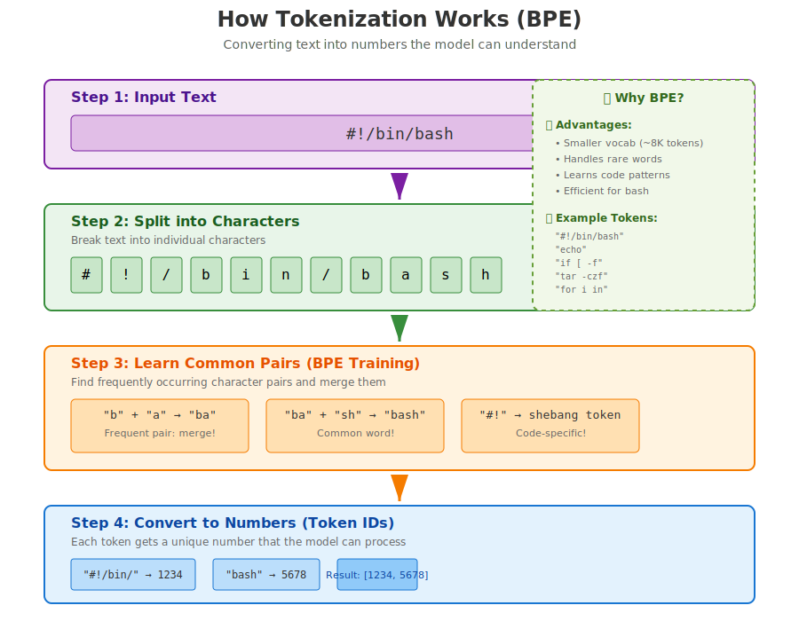
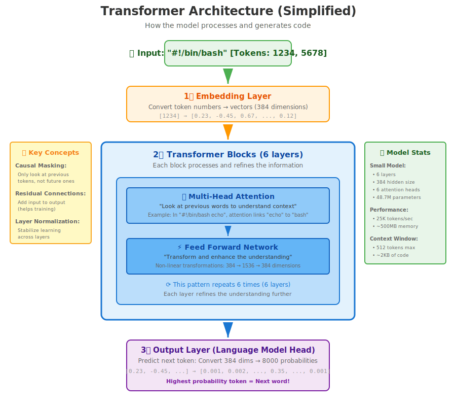
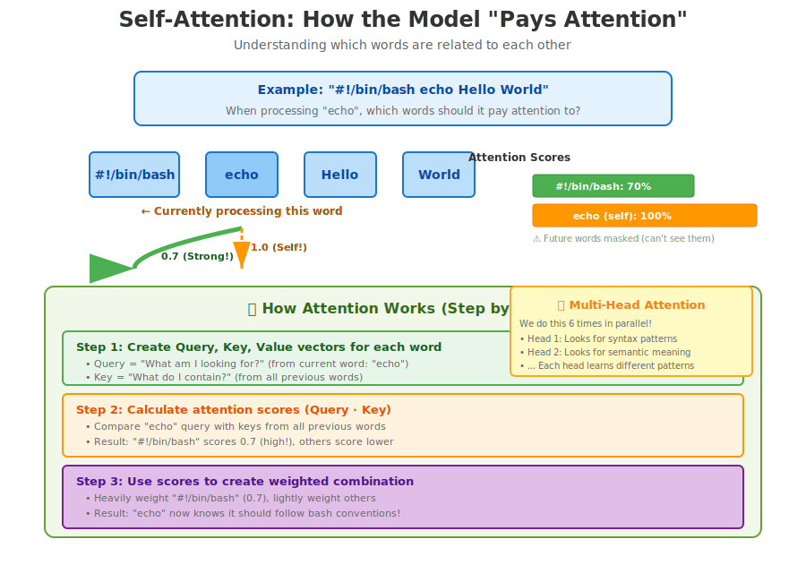
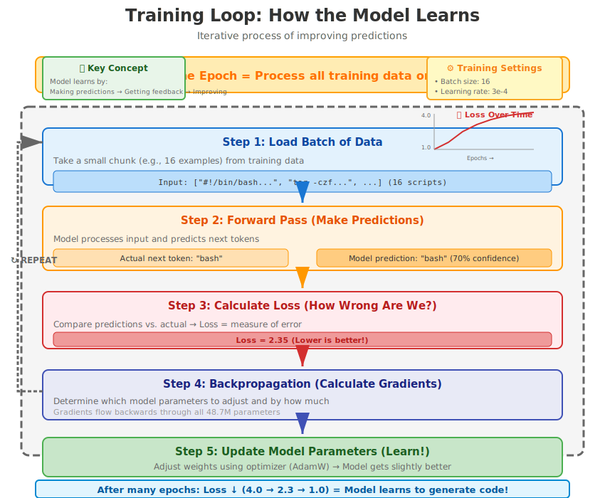

# Visual Learning Guide

This guide presents all visual diagrams with detailed explanations. Perfect for beginners who learn better visually!

## Table of Contents

1. [Two-Stage Training Pipeline](#1-two-stage-training-pipeline)
2. [How Tokenization Works](#2-how-tokenization-works)
3. [Transformer Architecture](#3-transformer-architecture)
4. [Attention Mechanism](#4-attention-mechanism)
5. [Training Loop](#5-training-loop)
6. [Generation Process](#6-generation-process)

---

## 1. Two-Stage Training Pipeline

**What is it?**
This diagram shows the modern approach to training code generation models, used by industry leaders like CodeLlama and GitHub Copilot.


**Why two stages?**

### Stage 1: Language Pretraining (2-4 hours)
- **Input**: TinyStories dataset (18,740 English texts)
- **What the model learns**:
  - English grammar and syntax
  - Vocabulary and word relationships
  - Reasoning and logic patterns
- **Result**: A model that understands natural language
- **Loss**: Starts at ~4.0, ends at ~2.3

### Stage 2: Code Fine-tuning (30-60 minutes)
- **Input**: 100+ production bash scripts
- **What the model learns**:
  - Bash syntax and commands
  - Code patterns and idioms
  - Best practices
- **Result**: A model that can translate English → Code
- **Loss**: Starts at ~2.0, ends at ~1.0

**Key Insight**: It's faster and more efficient to teach language first, then code, rather than learning both simultaneously!

---

## 2. How Tokenization Works

**What is it?**
Tokenization converts human-readable text into numbers that the model can process. We use BPE (Byte Pair Encoding) because it's perfect for code!



**Step-by-Step Process:**

### Step 1: Input Text
```
#!/bin/bash
```

### Step 2: Split into Characters
```
['#', '!', '/', 'b', 'i', 'n', '/', 'b', 'a', 's', 'h']
```

### Step 3: Learn Common Pairs (BPE Magic!)
BPE training finds frequently occurring character combinations:
- `'b' + 'a'` → `'ba'` (frequent pair)
- `'ba' + 'sh'` → `'bash'` (common word)
- `'#' + '!'` → shebang token (code-specific!)

**Why this is smart:**
- Common bash commands become single tokens
- Rare words are split into subwords (handles new vocabulary)
- Efficient: ~8,000 token vocabulary vs millions of words

### Step 4: Convert to Numbers
```
"#!/bin/bash" → [1234, 5678]
```

**Benefits for Code:**
- `tar -czf` might be a single token
- `for i in` becomes one token
- Model learns code patterns faster!

---

## 3. Transformer Architecture

**What is it?**
The "brain" of the model. A transformer processes input through multiple layers to understand and generate code.



**Component Breakdown:**

### 1️⃣ Embedding Layer
- **Purpose**: Convert token IDs into rich vector representations
- **Process**: `[1234]` → `[0.23, -0.45, 0.67, ..., 0.12]` (384 numbers)
- **Why**: Numbers carry meaning (similar tokens have similar vectors)

### 2️⃣ Transformer Blocks (6 layers)
Each of the 6 layers has two main parts:

**Part A: Multi-Head Attention**
- **Purpose**: "Look at previous words to understand context"
- **Example**: When processing "echo", it looks back at "#!/bin/bash" to understand it's in a bash script context
- **Multi-head**: 6 attention heads look for different patterns
  - Head 1: Syntax patterns
  - Head 2: Semantic meaning
  - Head 3: Code structure
  - etc.

**Part B: Feed Forward Network**
- **Purpose**: Transform and enhance the understanding
- **Process**: Non-linear transformations (384 → 1536 → 384 dimensions)
- **Why**: Adds complexity and expressive power

**This pattern repeats 6 times**, each layer refining the understanding!

### 3️⃣ Output Layer (Language Model Head)
- **Purpose**: Predict the next token
- **Process**: 384 dimensions → 8,000 probabilities (one for each token)
- **Result**: Highest probability token = Next word!

**Model Statistics (Small):**
- Parameters: 48.7 million
- Speed: 25,000 tokens/second
- Memory: ~500MB
- Context: 512 tokens (~2KB of code)

---

## 4. Attention Mechanism

**What is it?**
The "magic" that lets the model understand which words are related to each other!



**Real Example:**

Processing: `#!/bin/bash echo Hello World`

When the model is at the word **"echo"**, attention asks:
> "Which previous words should I pay attention to?"

**Attention Scores:**
- `#!/bin/bash`: 0.7 (70% - Strong!)
  → "This tells me I'm writing a bash script"
- `echo` (self): 1.0 (100%)
  → "This is the word I'm currently processing"
- Future words: Masked (can't see the future!)

**How it Works (3 Steps):**

### Step 1: Create Query, Key, Value Vectors
- **Query** = "What am I looking for?" (from current word: "echo")
- **Key** = "What do I contain?" (from all previous words)
- **Value** = "What information do I have?" (from all previous words)

### Step 2: Calculate Attention Scores
```
Similarity = Query · Key
```
- Compare "echo" query with keys from all previous words
- "#!/bin/bash" scores high → relevant context!

### Step 3: Create Weighted Combination
- Use attention scores to weight the values
- Result: "echo" now knows it's in a bash script context!

**Multi-Head Attention:**
- We do this 6 times in parallel (6 heads)
- Each head learns to look for different patterns
- Results are combined for rich understanding

**Why This Matters:**
Without attention, the model would treat each word independently. With attention, it understands relationships and context!

---

## 5. Training Loop

**What is it?**
The iterative process where the model learns from examples.



**One Training Iteration (5 Steps):**

### Step 1: Load Batch of Data
- Take a small chunk (e.g., 16 examples) from training data
- Example: `["#!/bin/bash...", "tar -czf...", ...]`

### Step 2: Forward Pass (Make Predictions)
- Model processes input
- Predicts what comes next
- Example:
  - **Actual**: "bash"
  - **Prediction**: "bash" with 70% confidence

### Step 3: Calculate Loss (How Wrong Are We?)
- Compare predictions vs. actual next tokens
- **Loss = measure of error**
- Example: Loss = 2.35
- **Lower is better!**

### Step 4: Backpropagation (Calculate Gradients)
- Determine how to adjust each of the 48.7M parameters
- Gradients flow backwards through all layers
- Tells us: "Increase this parameter, decrease that one"

### Step 5: Update Parameters (Learn!)
- Use optimizer (AdamW) to adjust weights
- Model gets slightly better
- Repeat!

**The Magic of Iteration:**

```
Epoch 1:  Loss = 4.0 (Model is confused)
Epoch 5:  Loss = 2.5 (Getting better!)
Epoch 10: Loss = 2.3 (Good understanding!)
Epoch 20: Loss = 1.0 (Excellent for code!)
```

**Key Settings:**
- **Batch Size**: 16 examples at a time
- **Learning Rate**: 3e-4 (how big each adjustment is)
- **Epochs**: 10-20 (how many times we see all data)

---

## 6. Generation Process

**What is it?**
How the trained model creates code one token at a time (autoregressive generation).


**Step-by-Step Walkthrough:**

### Step 0: User Provides Prompt
```
"#!/bin/bash
# Create a backup script"
```

### Then Loop Until Complete:

### Step 1: Tokenize Current Text
- Convert text → token IDs
- Example: `"#!/bin/bash\n#"` → `[1234, 5678, 9012]`

### Step 2: Model Prediction
- Run through transformer
- Get probabilities for all 8,000 possible next tokens
- Example results:
  ```
  "tar": 35%
  "echo": 20%
  "cd": 15%
  "if": 10%
  ...
  ```

### Step 3: Sample Next Token
- Use temperature & top-k/top-p to choose
- **Temperature = 0.8**: Slightly random (creative)
- **Top-k = 50**: Only consider top 50 options
- **Result**: Selected "tar" (it had highest probability)

### Step 4: Update Text & Repeat
```
Updated text: "#!/bin/bash
# Create a backup script
tar"
```
- Go back to Step 1
- Continue until max_length or stop token

**Generation Settings:**

| Parameter | Value | Effect |
|-----------|-------|--------|
| Max Length | 200 tokens | Stop after 200 tokens |
| Temperature | 0.8 | Balance creativity/focus |
| Top-k | 50 | Consider top 50 tokens |
| Top-p | 0.9 | Nucleus sampling threshold |

**Temperature Effects:**
- **Low (0.2)**: Very focused, deterministic, safe
- **Medium (0.8)**: Balanced, recommended
- **High (1.5)**: Very creative, more random

**Complete Example:**

```
Prompt: "#!/bin/bash\n# Create a backup script"

Generation:
→ tar
→ -czf
→ backup.tar.gz
→ /data
→ echo
→ "Backup complete"

Final Output:
#!/bin/bash
# Create a backup script
tar -czf backup.tar.gz /data
echo "Backup complete"
```

---

## Learning Path Using Diagrams

### For Complete Beginners:
1. Start with **Two-Stage Training** (understand the overall approach)
2. Then **Tokenization** (how text becomes numbers)
3. Then **Transformer Architecture** (the model structure)
4. Finally **Generation** (how code is created)

### For Understanding How It Works:
1. **Tokenization** → See how text is processed
2. **Attention** → Understand the "magic"
3. **Training Loop** → See how learning happens
4. **Generation** → See how output is created

### For Implementation:
1. **Transformer Architecture** → Build the model
2. **Training Loop** → Train the model
3. **Generation** → Use the model
4. **Attention** → Optimize the model

---

## Quick Reference

| Diagram | Best For | Key Takeaway |
|---------|----------|--------------|
| Two-Stage Training | Understanding strategy | Language first, then code |
| Tokenization | Understanding preprocessing | Text → Numbers via BPE |
| Transformer | Understanding architecture | Embeddings → Attention → Output |
| Attention | Understanding "magic" | Model learns relationships |
| Training Loop | Understanding learning | Predict → Compare → Adjust |
| Generation | Understanding output | One token at a time |

---

## Additional Resources

- **Full Tutorial**: [GETTING_STARTED.md](../GETTING_STARTED.md)
- **Architecture Details**: [ARCHITECTURE.md](ARCHITECTURE.md)
- **Hands-on Practice**: [presentation/interactive_demo.ipynb](../presentation/interactive_demo.ipynb)

---

**Visual learning works!** These diagrams break down complex concepts into understandable pieces. Refer back to them as you learn and build your own models!
